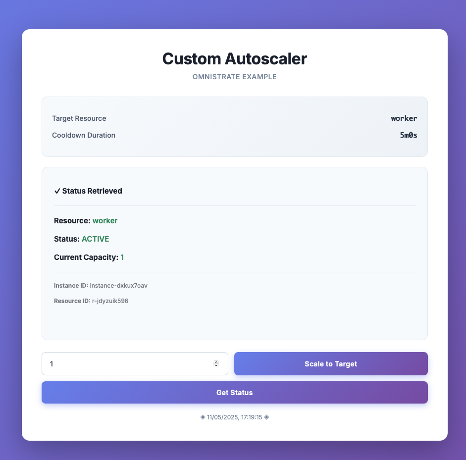

# Custom Auto Scaling Example for Omnistrate

A reference implementation demonstrating how to build custom autoscaling logic for resources deployed on the Omnistrate platform. This example shows how to create a standalone autoscaling controller that interacts with Omnistrate's local sidecar API to dynamically scale resources based on custom logic.

## What Problem Does This Solve?

Omnistrate provides built-in autoscaling capabilities that can scale your resources based on infrastructure metrics (CPU, memory) and application-specific metrics. However, some use cases require **custom business logic or complex decision-making** that goes beyond simple metric thresholds, such as:

- **Complex scaling logic** that combines multiple conditions or business rules
- **Predictive scaling** based on historical data, time series forecasting, or ML models
- **Custom scheduling patterns** with complex rules (e.g., different capacity for specific days, holidays, or events)
- **Integration with external systems** for scaling decisions (e.g., external monitoring, ticketing systems)
- **Multi-stage scaling workflows** that require coordination between multiple resources
- **Custom cooldown or ramping logic** beyond standard configurations
- **A/B testing or canary scaling** patterns with custom rollout logic

This example demonstrates how to implement autoscaling based on **any custom logic** you define, giving you programmatic control over scaling decisions when Omnistrate's native metric-based autoscaling doesn't fit your specific requirements.

## Overview

This project provides a custom autoscaling controller written in Go that can scale Omnistrate resources up or down based on user-defined policies. Unlike standard autoscaling solutions that rely on predefined metrics, this implementation allows you to define completely custom scaling logic while leveraging Omnistrate's capacity management API.

### Key Features

- **Custom Scaling Logic**: Define your own scaling policies and triggers based on any metric or business logic
- **Language Agnostic**: While this example uses Go, you can implement autoscaling in any language (see [API Guide](OMNISTRATE_API_GUIDE.md))
- **HTTP API**: Simple REST API for triggering scaling operations and checking status
- **Status Monitoring**: Real-time visibility into current capacity and scaling operations
- **Production Ready**: Includes cooldown management, state handling, and error recovery

## Architecture

The controller consists of several components:

1. **HTTP Server** (`cmd/controller.go`): Exposes REST endpoints for scaling operations and status checks
2. **Autoscaler** (`internal/autoscaler/`): Core scaling logic with cooldown management
3. **Omnistrate API Client** (`internal/omnistrate_api/`): Communicates with the Omnistrate sidecar
4. **Configuration** (`internal/config/`): Environment-based configuration management

### How It Works

1. The controller runs as a service alongside your Omnistrate resources
2. It communicates with the Omnistrate platform via a local sidecar API at `http://127.0.0.1:49750`
3. You implement your custom scaling logic (e.g., check queue length, API metrics, etc.)
4. When a scaling decision is made, the controller:
   - Checks if a scaling operation is already in progress
   - Waits for any active cooldown period to expire
   - Waits for the resource to be in an `ACTIVE` state
   - Gradually scales the resource to the target capacity in configured steps

### When to Use This Approach

**Use Omnistrate's native metric-based autoscaling when:**

- ✅ Scaling based on CPU, memory, or application metrics (queue length, request rate, etc.) meets your needs
- ✅ You want a fully managed, zero-code autoscaling solution
- ✅ Simple threshold-based scaling rules are sufficient for your workload
- ✅ You don't need custom business logic or complex decision-making

**Use custom autoscaling (this example) when:**

- ✅ You need to implement **complex business logic** that combines multiple conditions or rules
- ✅ You want **predictive scaling** based on ML models, time series forecasting, or historical patterns
- ✅ You require **custom scheduling** with complex rules (holidays, events, multi-stage rollouts)
- ✅ You need to **integrate external systems** into your scaling decisions
- ✅ You want to implement **custom cooldown strategies** or multi-resource coordination
- ✅ You need **programmatic control** over scaling with language-specific libraries or frameworks
- ✅ Standard metric-based thresholds don't capture your scaling requirements

## Getting Started

### Prerequisites

- Go 1.19 or higher
- Docker (for containerized deployment)
- An Omnistrate service with autoscaling enabled

### Configuration

The controller is configured via environment variables:

| Variable | Description | Default | Required |
|----------|-------------|---------|----------|
| `AUTOSCALER_TARGET_RESOURCE` | Resource alias to scale (must match resource key in compose) | - | Yes |
| `AUTOSCALER_COOLDOWN` | Cooldown period in seconds between scaling operations | 300 | No |
| `AUTOSCALER_STEPS` | Number of capacity units to add/remove per operation | 1 | No |
| `AUTOSCALER_WAIT_FOR_ACTIVE_TIMEOUT` | Max time to wait for resource to become ACTIVE (seconds) | 900 | No |
| `AUTOSCALER_WAIT_FOR_ACTIVE_CHECK_INTERVAL` | Interval between status checks (seconds) | 30 | No |
| `DRY_RUN` | Enable dry-run mode (no actual API calls) | false | No |
| `PORT` | HTTP server port | 3000 | No |

### Example Service Configuration

Here's how to configure autoscaling in your `omnistrate-compose.yaml`:

```yaml
version: '3.9'

x-omnistrate-load-balancer:
  https:
    - name: frontend
      description: L7 Load Balancer for the controller UI
      paths:
        - associatedResourceKey: controller
          path: /
          backendPort: 3000

services:
  controller:
    depends_on:
      - worker
    image: ghcr.io/omnistrate-community/custom-auto-scaling-example:0.0.5
    ports:
      - '3000:3000'
    environment:
      - AUTOSCALER_COOLDOWN=300
      - AUTOSCALER_TARGET_RESOURCE=worker  # Must match the service name
      - AUTOSCALER_STEPS=1

  worker:
    x-omnistrate-mode-internal: true
    x-omnistrate-capabilities:
      autoscaling:
        policyType: custom       # Enable custom autoscaling
        maxReplicas: 6          # Maximum capacity
        minReplicas: 1          # Minimum capacity
    image: busybox:1.37.0
    command: ['sh', '-c', 'while true; do echo Working...; sleep 10; done']
```

**Key Configuration Notes:**

- Set `policyType: custom` in the `x-omnistrate-capabilities.autoscaling` section
- Set `x-omnistrate-mode-internal: true` to make the worker resource internal
- The `AUTOSCALER_TARGET_RESOURCE` must match the service key you want to scale (e.g., `worker`)
- The controller resource should have `depends_on` to ensure the target resource is created first

### Local Development

#### Build the Controller

```bash
make build
```

This creates a `controller` binary in the current directory.

#### Run Tests

```bash
make unit-test
```

## Scaling Behavior

### Cooldown Period

The cooldown period prevents rapid successive scaling operations:

- After each scaling action, the controller waits for the cooldown duration
- Default: 300 seconds (5 minutes)
- Configurable via `AUTOSCALER_COOLDOWN`

### Step-based Scaling

Scaling happens gradually in steps:

- Each operation adds or removes a fixed number of capacity units
- Default: 1 step per operation
- Configurable via `AUTOSCALER_STEPS`
- The controller will perform multiple operations if needed to reach the target

### State Management

The controller waits for the resource to be in an `ACTIVE` state before scaling:

- If a resource is `STARTING`, it waits until `ACTIVE`
- If a resource is `FAILED`, the operation fails
- Maximum wait time is configurable via `AUTOSCALER_WAIT_FOR_ACTIVE_TIMEOUT`

## API Reference

This example includes a Go implementation, but you can implement custom autoscaling in **any programming language** that supports HTTP requests.

📘 **[Complete API Guide](OMNISTRATE_API_GUIDE.md)** - Comprehensive documentation including:

- Detailed API endpoint specifications
- Complete implementations in multiple languages (Go, Python, Node.js, Java, Ruby)
- Best practices for production deployments
- Common scaling patterns (metric-based, scheduled, predictive)
- Troubleshooting guide

The API guide provides production-ready code examples you can adapt to your preferred language and use case.

## Example UI

To allow you to test the behavior, this example provides a simple UI that can be used to trigger scaling operations:



## Implementing Custom Scaling Logic

The core of custom autoscaling is implementing your own scaling decision logic. Here are some examples:

### Example 1: Queue-Based Scaling

```go
func scaleBasedOnQueueLength(autoscaler *Autoscaler, queueName string) {
    queueLength := getQueueLength(queueName) // Your queue monitoring
    currentCapacity := autoscaler.GetCurrentCapacity()
    
    // Scale up if queue > 100 items per worker
    if queueLength > currentCapacity * 100 {
        targetCapacity := (queueLength / 100) + 1
        autoscaler.ScaleToTarget(context.Background(), targetCapacity)
    }
    
    // Scale down if queue < 50 items per worker
    if queueLength < currentCapacity * 50 && currentCapacity > 1 {
        targetCapacity := max(1, queueLength / 50)
        autoscaler.ScaleToTarget(context.Background(), targetCapacity)
    }
}
```

### Example 2: Time-Based Scaling

```go
func scaleBasedOnSchedule(autoscaler *Autoscaler) {
    hour := time.Now().Hour()
    
    var targetCapacity int
    if hour >= 9 && hour < 17 {
        targetCapacity = 10 // Business hours
    } else {
        targetCapacity = 2  // Off hours
    }
    
    autoscaler.ScaleToTarget(context.Background(), targetCapacity)
}
```

### Example 3: Multi-Metric Scaling

```go
func scaleBasedOnMultipleMetrics(autoscaler *Autoscaler) {
    cpuUsage := getAverageCPU()
    requestRate := getRequestsPerSecond()
    errorRate := getErrorRate()
    
    // Scale up if any metric exceeds threshold
    if cpuUsage > 80 || requestRate > 1000 || errorRate > 0.05 {
        currentCapacity := autoscaler.GetCurrentCapacity()
        autoscaler.ScaleToTarget(context.Background(), currentCapacity + 2)
    }
}
```

See the [API Guide](OMNISTRATE_API_GUIDE.md) for more examples in multiple programming languages.

## Troubleshooting

### Controller Cannot Connect to Sidecar

**Problem**: Controller logs show connection errors to `http://127.0.0.1:49750`

**Solution**: Ensure the controller is deployed as part of an Omnistrate service. The sidecar is only available when running on Omnistrate.

### Resource Not Scaling

**Problem**: Scaling operations don't seem to take effect

**Solutions**:

- Verify `AUTOSCALER_TARGET_RESOURCE` matches your service key in `omnistrate-compose.yaml`
- Check that `policyType: custom` is set in the resource's autoscaling configuration
- Ensure `minReplicas` and `maxReplicas` are configured correctly
- Review controller logs for error messages

### Scaling Too Slowly or Too Quickly

**Problem**: Resources scale too aggressively or not fast enough

**Solutions**:

- Adjust `AUTOSCALER_COOLDOWN` to control time between scaling operations
- Modify `AUTOSCALER_STEPS` to scale by more/fewer units per operation
- Review your custom scaling logic thresholds

For more troubleshooting guidance, see the [API Guide](OMNISTRATE_API_GUIDE.md#troubleshooting).

## Contributing

Contributions are welcome! This is a reference implementation intended to demonstrate custom autoscaling patterns. Feel free to fork and adapt for your specific use case.

## License

See [LICENSE](LICENSE) file for details.

## Additional Resources

- 📘 [Complete API Guide](OMNISTRATE_API_GUIDE.md) - Multi-language implementation guide
- 📦 [Omnistrate Documentation](https://docs.omnistrate.com) - Platform documentation
- 🐙 [Omnistrate Community Examples](https://github.com/omnistrate-community) - More examples

## Support

For issues related to:

- **This example**: Open an issue in this repository
- **API usage**: See the [API Guide](OMNISTRATE_API_GUIDE.md) for detailed examples
- **Omnistrate platform**: Contact Omnistrate support or visit [omnistrate.com](https://omnistrate.com)
